# ⚽ Live Score App

A modern **Flutter Live Score application** that provides real-time and non-real-time match results, detailed information about teams, leagues, and matches, with powerful search and favorite teams support.

The app is built using **Clean Architecture** principles to ensure scalability, maintainability, and testability.

---

## 🚀 Features

- 🔴 **Live Match Scores** (real-time updates)
- 🕒 **Live Match Results**
- 🏟️ **Match Details**
  - Lineups
  - Match status
  - Scores & time
- 🏆 **Leagues & Competitions**
- 👥 **Team Details**
  - Team info
  - Recent matches
- ⭐ **Favorite Teams**
  - Save teams locally
- 🔍 **Search**
  - Search for teams, leagues, or matches

---

 ## 🧱 Architecture & Tech Stack

- **Clean Architecture**
- **Cubit (Bloc State Management)**
- **Dio (REST API Integration)**
- **Hive (Local Database & Caching)**
- **Live Score REST APIs**

---

## 📸 App Screenshots

| | | | | |
|---|---|---|---|---|
|  | 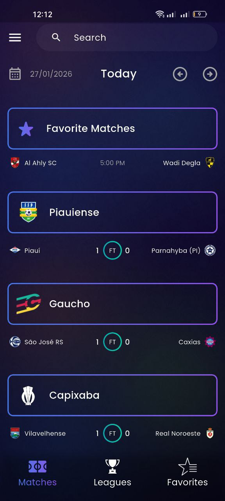 | 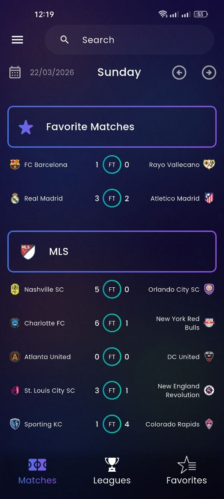 | 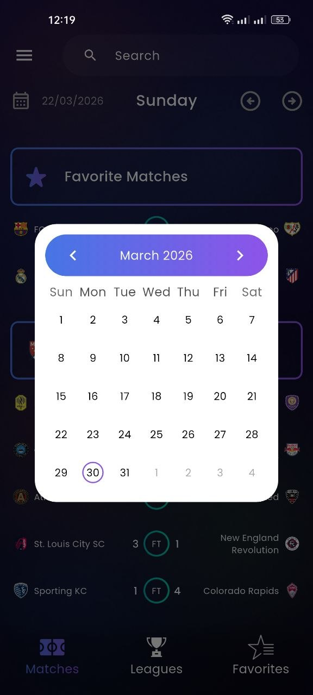 | 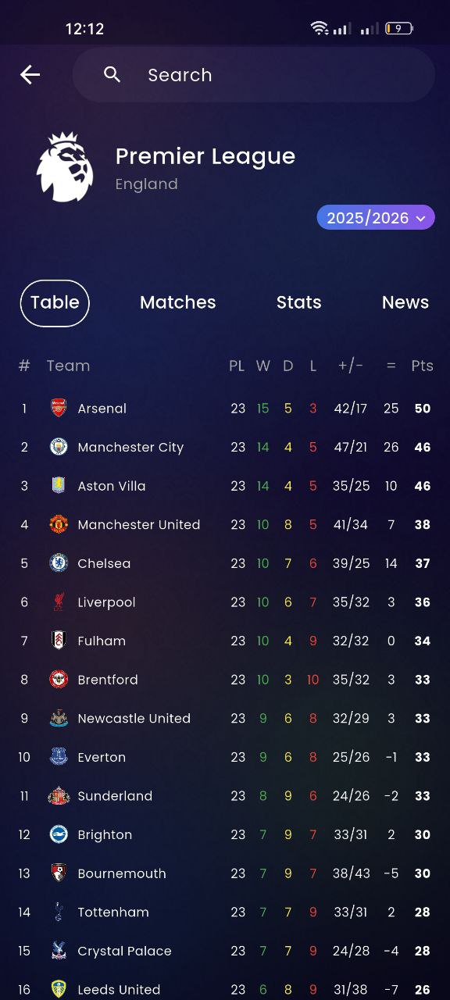 |
| 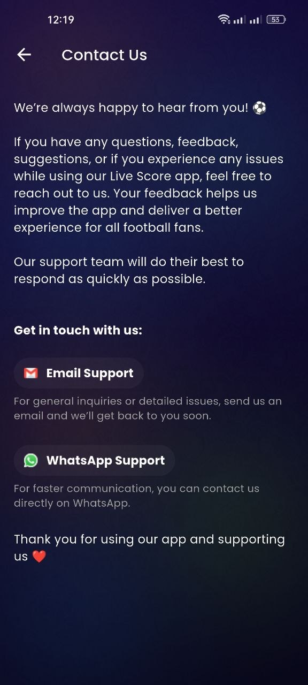 | 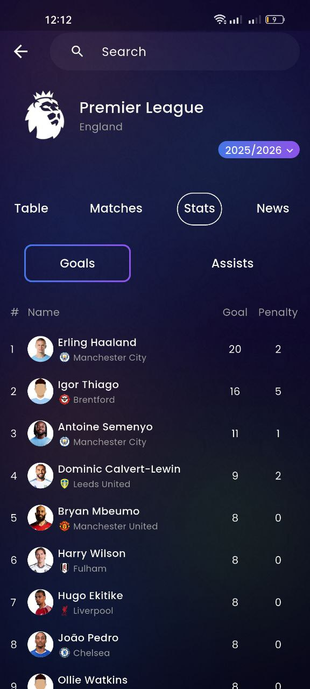 | 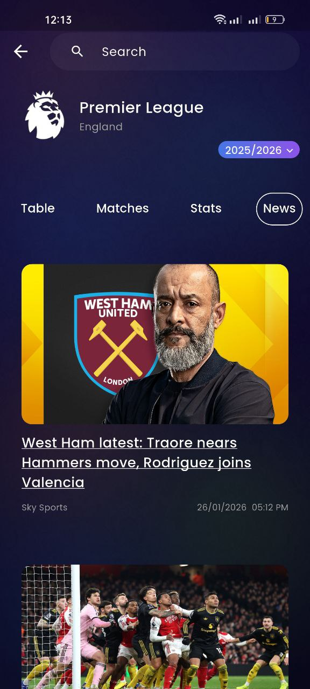 | 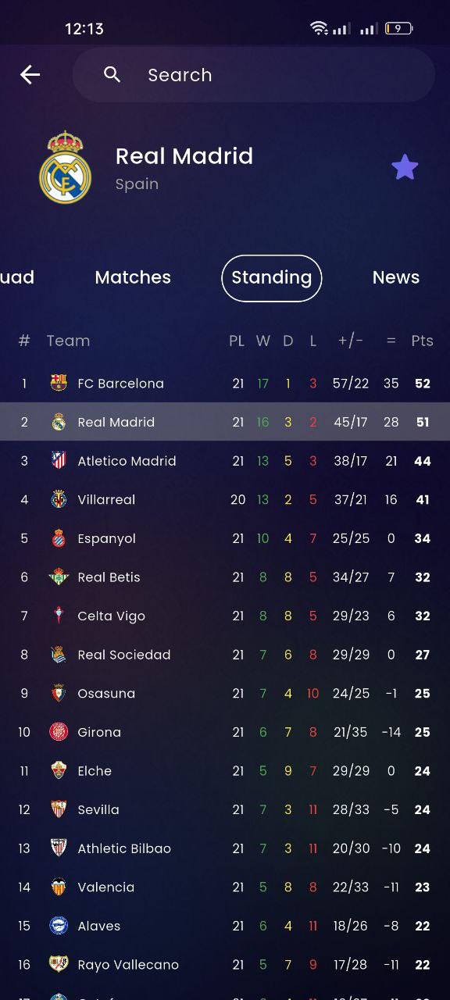 | 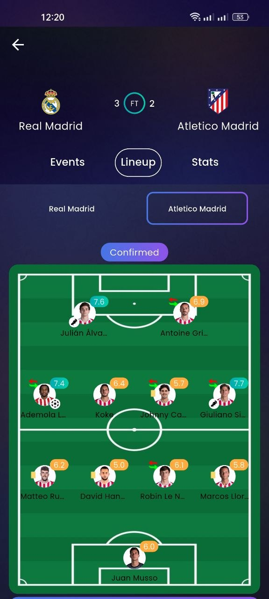 |
| 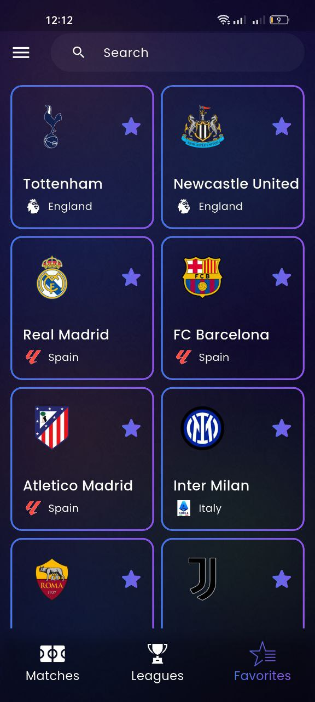 | 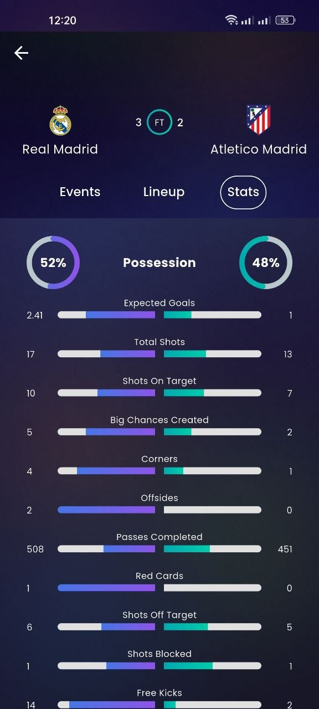 | 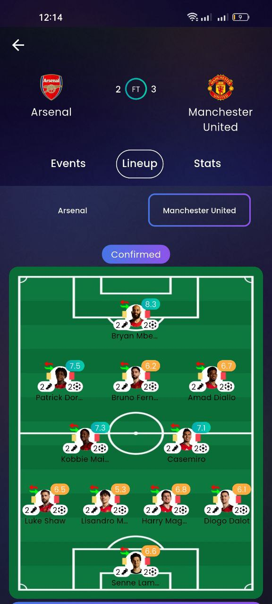 | 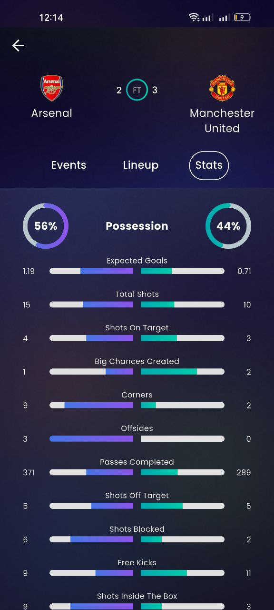 | 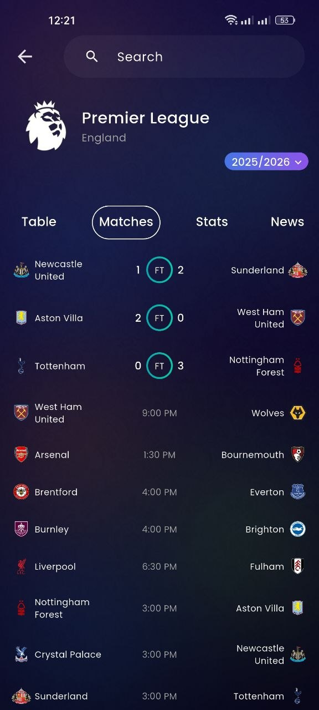 |
| 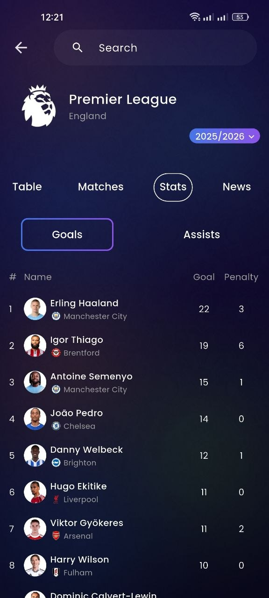 | 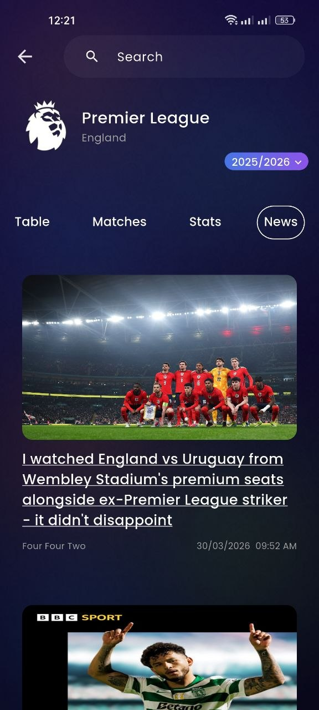 | 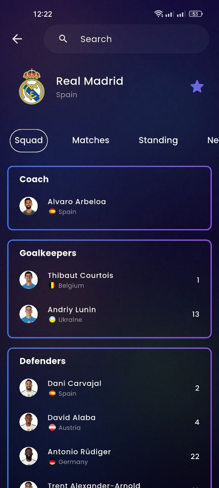 | 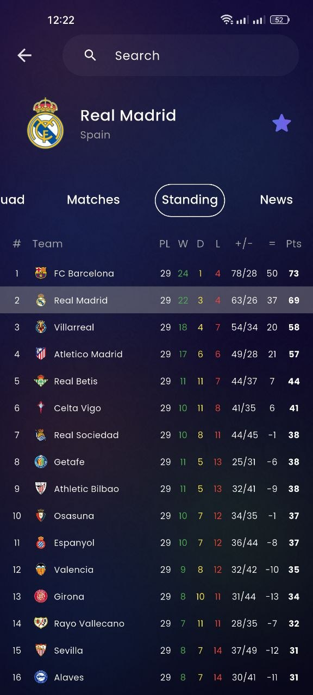 | 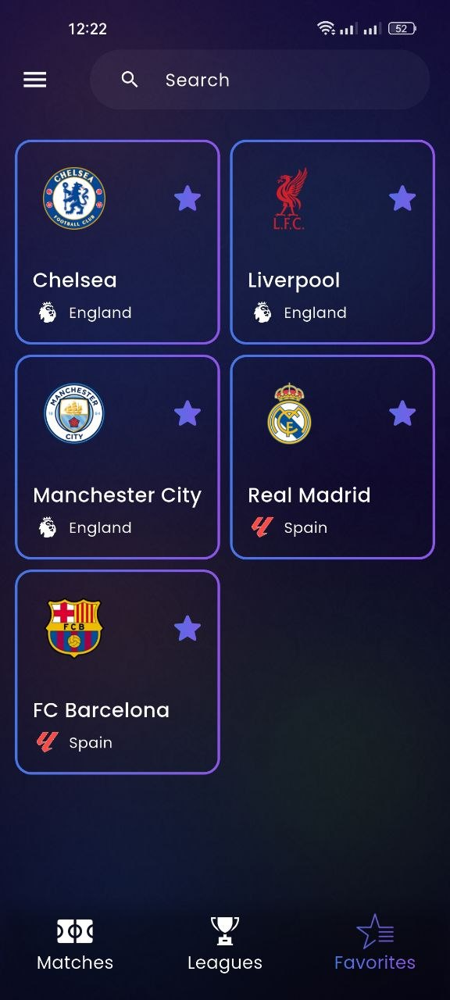 |
